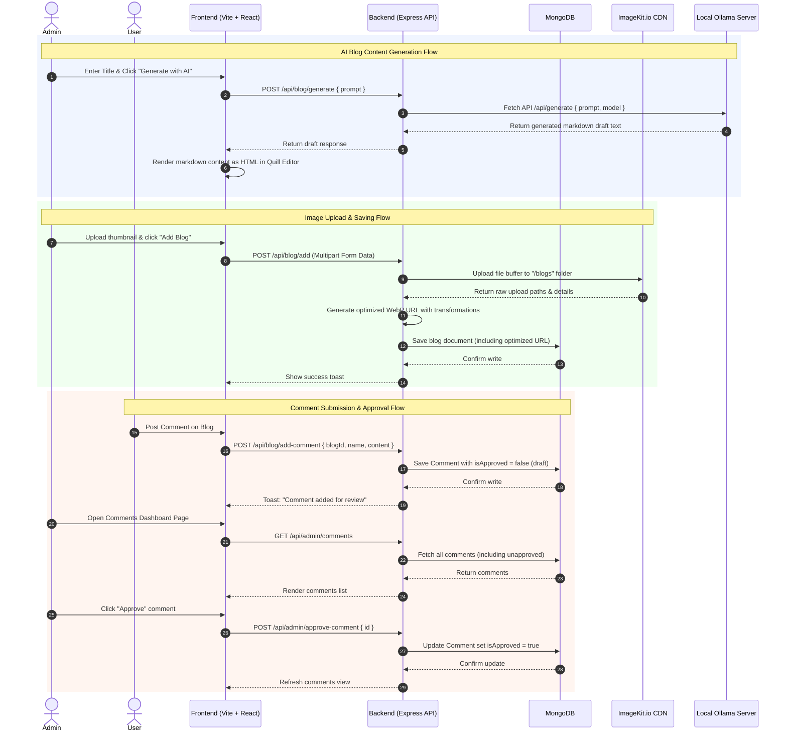

# ✍️ BLOGGERR — Full-Stack AI-Powered Blogging Platform

[](https://react.dev/)
[](https://expressjs.com/)
[](https://www.mongodb.com/)
[](https://ollama.com/)
[](https://imagekit.io/)
[](https://tailwindcss.com/)

A modern, high-performance, full-stack blogging web application featuring **local AI content drafting** powered by Ollama, high-efficiency image processing using the ImageKit CDN, a clean WYSIWYG text editor, and a comprehensive admin moderation panel.

---

## 🌟 Key Features

*   🤖 **AI Content Generation**: Generate complete, high-quality markdown blog drafts locally from a single title using [Ollama](https://ollama.com/) (defaults to `llama3.2:1b` or `llama3.1`).
*   🖼️ **ImageKit CDN Integration**: Upload, store, and serve blog thumbnails with real-time compression, WebP modern format conversion, and custom responsive resizing.
*   ✏️ **Rich Text Editing**: Write articles using a fully-integrated [Quill.js](https://quilljs.com/) WYSIWYG editor inside the admin suite.
*   💬 **Moderated Comment Section**: Allow readers to comment on published articles. Comments undergo admin moderation (approve/reject workflow) before going public.
*   🔒 **Secure JWT Authentication**: Protect dashboard operations, blog publishing, deletion, and comment moderation using JSON Web Tokens.
*   📊 **Interactive Admin Dashboard**: Access analytics such as total blogs, drafts, comments count, and view recent activity at a glance.
*   🎨 **Sleek, Responsive UI**: Built with a neo-brutalist custom styling theme using Tailwind CSS (v4), smooth transition micro-animations (Framer Motion), and reactive toast notifications.

---

## 🚀 Tech Stack

### Frontend (Client)
*   **Core**: React 19, Vite (Fast HMR)
*   **Styling**: Tailwind CSS v4 (Modern CSS Utility Class Engine)
*   **Routing**: React Router DOM (v7)
*   **Rich Text & Markdown**: Quill.js, Marked (Markdown parser)
*   **Animations & Alerts**: Motion (Framer Motion), React Hot Toast
*   **API Client**: Axios

### Backend (Server)
*   **Runtime & Server**: Node.js, Express (v5)
*   **Database ORM**: Mongoose (MongoDB)
*   **File Uploads**: Multer (Multipart Form Data handling)
*   **Security & Auth**: jsonwebtoken (JWT), Cors, dotenv

### Cloud Services & Local Services
*   **Image Cloud Service**: ImageKit.io API (CDN & image transformation)
*   **AI Engine**: Ollama (Running locally via localhost API)
*   **Database**: MongoDB Atlas / Local MongoDB instance

---

## 📂 Project Architecture & Directory Layout

```text
BLOGGERR/
├── client/                     # Frontend Application
│   ├── src/
│   │   ├── assets/             # Images, icons, and static assets
│   │   ├── components/         # Reusable layouts (Navbar, BlogCard, etc.)
│   │   │   └── admin/          # Admin-specific UI elements (Login, Sidebar)
│   │   ├── context/            # Global context state (AppContext.jsx)
│   │   ├── pages/              # View pages (Home, Blog)
│   │   │   └── admin/          # Admin operations pages (AddBlog, Dashboard, etc.)
│   │   ├── App.jsx             # Main Application Routes
│   │   ├── main.jsx            # React Bootstrap Entry
│   │   └── index.css           # Global custom stylesheet
│   ├── package.json            # Client-side configuration
│   └── vite.config.js          # Vite config (React & Tailwind setup)
│
├── server/                     # Backend API Service
│   ├── configs/                # Integrations (DB, ImageKit, local Ollama LLM)
│   ├── controllers/            # Request handlers (adminController, blogController)
│   ├── middleware/             # Express middlewares (auth, multer image parser)
│   ├── models/                 # Mongoose Database Schemas (Blog, Comment)
│   ├── routes/                 # API endpoint routers (adminRoutes, blogRoutes)
│   ├── server.js               # Express application entry-point
│   └── package.json            # Server-side configuration
```

---

## 📈 System Architecture Workflow



---

## ⚙️ Local Configuration & Environment Setup

### 1. Prerequisites
Ensure you have the following installed on your machine:
*   [Node.js](https://nodejs.org/) (v18.x or later)
*   [MongoDB](https://www.mongodb.com/) (either running locally or a MongoDB Atlas connection string)
*   [Ollama CLI](https://ollama.com/) (running locally on port `11434` with `llama3.2:1b` or `llama3.1` model downloaded)

### 2. Environment Variables

Create `.env` files in both the `client` and `server` directories based on the configurations below:

#### Backend Config (`server/.env`)
```ini
# JWT Configuration
JWT_SECRET="your_jwt_signing_secret_here"

# Admin Dashboard Login Credentials
ADMIN_EMAIL="admin@example.com"
ADMIN_PASSWORD="your_secure_admin_password_here"

# MongoDB Database Connection
MONGODB_URI="mongodb+srv://<user>:<password>@cluster.mongodb.net"

# ImageKit Configuration (Get these from your ImageKit Dashboard)
IMAGEKIT_PUBLIC_KEY="public_..."
IMAGEKIT_PRIVATE_KEY="private_..."
IMAGEKIT_URL_ENDPOINT="https://ik.imagekit.io/<your_id>"

# Local LLM Config (Ollama)
OLLAMA_API_URL="http://localhost:11434"
OLLAMA_MODEL="llama3.2:1b"
```

#### Frontend Config (`client/.env`)
```ini
# Backend API Base URL
VITE_BASE_URL="http://localhost:3000"
```

---

## 🛠️ Step-by-Step Installation

### Step 1: Clone the Repository
```bash
git clone https://github.com/Abhas7/QuickBlog-FullStack.git
cd QuickBlog-FullStack
```

### Step 2: Setup the Backend (Server)
1. Navigate to the server directory:
   ```bash
   cd server
   ```
2. Install server dependencies:
   ```bash
   npm install
   ```
3. Create your `.env` file inside the `server/` directory and populate it with your database, JWT, ImageKit, and Ollama configs.
4. Run the server in development mode:
   ```bash
   npm run server
   ```

### Step 3: Setup the Frontend (Client)
1. Open a new terminal window at the root folder and navigate to client:
   ```bash
   cd client
   ```
2. Install client dependencies:
   ```bash
   npm install
   ```
3. Create your `.env` file inside the `client/` directory containing the `VITE_BASE_URL` API URL endpoint.
4. Start the Vite development server:
   ```bash
   npm run dev
   ```

### Step 4: Run Ollama (For Local AI)
To use the local AI generation feature, make sure the Ollama server is active and the required model is pulled locally:
```bash
# Verify Ollama is installed and running
ollama run llama3.2:1b
```

---

## 📡 API Reference & Endpoints

All endpoints are prefixed with `/api`.

### Admin Routes (`/api/admin`)
| Endpoint | Method | Authentication | Payload | Description |
| :--- | :--- | :---: | :--- | :--- |
| `/login` | `POST` | ❌ None | `{ email, password }` | Authenticates administrator & returns JWT. |
| `/dashboard` | `GET` | 🔒 Yes (JWT) | None | Fetches total stats (blogs, drafts, comments count) and 5 recent posts. |
| `/blogs` | `GET` | 🔒 Yes (JWT) | None | Fetches all blogs (published and drafts) sorted by creation date. |
| `/comments` | `GET` | 🔒 Yes (JWT) | None | Fetches all comments with populated blog info, sorted by creation date. |
| `/approve-comment`| `POST` | 🔒 Yes (JWT) | `{ id }` | Approves a submitted comment (`isApproved` set to true). |
| `/delete-comment` | `POST` | 🔒 Yes (JWT) | `{ id }` | Deletes a comment by database object ID. |

### Blog Routes (`/api/blog`)
| Endpoint | Method | Authentication | Payload | Description |
| :--- | :--- | :---: | :--- | :--- |
| `/all` | `GET` | ❌ None | None | Retrieves all published blogs (`isPublished: true`). |
| `/:blogId` | `GET` | ❌ None | None | Retrieves detailed database record for a single blog. |
| `/add` | `POST` | 🔒 Yes (JWT) | `FormData` (image file & blog metadata) | Uploads thumbnail to ImageKit, optimizes url, and saves new blog. |
| `/delete` | `POST` | 🔒 Yes (JWT) | `{ id }` | Deletes a blog post and all its related comments. |
| `/toggle-publish` | `POST` | 🔒 Yes (JWT) | `{ id }` | Toggles the publish state (published vs draft) of a blog. |
| `/add-comment` | `POST` | ❌ None | `{ blog, name, content }` | Submits a comment for review (awaits admin approval). |
| `/comments` | `POST` | ❌ None | `{ blogId }` | Fetches all approved comments (`isApproved: true`) for a blog post. |
| `/generate` | `POST` | 🔒 Yes (JWT) | `{ prompt }` | Queries Ollama server to draft blog content based on prompt title. |

---

## 🖼️ Responsive Image Transformation (ImageKit)
Images uploaded to **BLOGGERR** undergo optimization through custom API integrations on the backend. This transforms raw upload links dynamically into compressed, CDN-served images:
```javascript
const optimizedImageUrl = imagekit.url({
    path: response.filePath,
    transformation: [
        { quality: 'auto' }, // Automatically compress
        { format: 'webp' },  // Deliver in next-gen WebP format
        { width: '1280' }    // Resize to max 1280px width
    ]
});
```

---

## 🎨 UI Designs & Layout Elements

### Home Feed
*   Header section welcoming readers.
*   Interactive filter bar sorted by Category tags (e.g. Startup, Technology, Lifestyle).
*   Clean responsive grid layout using neo-brutalist borders (`shadow-[4px_4px_0px_0px_rgba(0,0,0,1)]`) with hover states.

### Admin Suite
*   Simple sidebar navigation: **Dashboard**, **Add Blog**, **Blog List**, **Comments**.
*   Full Quill rich text styling framework (`quill.snow.css`) for standard editor toolbar options.
*   Status metrics counters for quick data analytics.

---

## 📝 License
This project is licensed under the ISC License. Feel free to clone, edit, and modify as needed!
