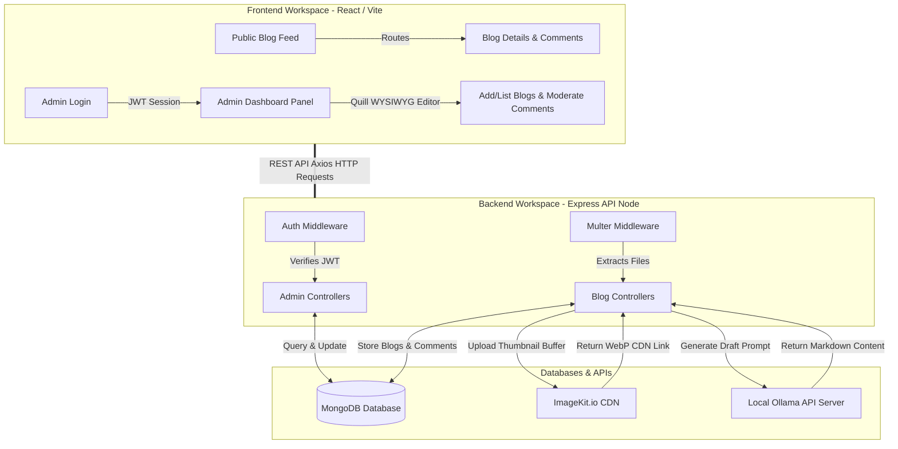
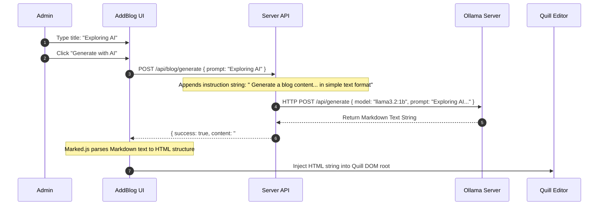

# 📐 BLOGGERR — Architecture & System Design Document

This document provides a detailed breakdown of the software architecture, system topology, data structures, and critical workflows for the **BLOGGERR** application.

---

## 🧭 System Topology & High-Level Architecture

**BLOGGERR** is built on a decoupled, client-server (MERN-like) architecture pattern, integrated with cloud storage CDNs and local AI generation engines.



---

## 🎨 Client Architecture (Frontend)

The frontend is a Single Page Application (SPA) powered by **React 19** and compiled with **Vite**.

### 1. Global State Architecture
Instead of utilizing heavy libraries like Redux, state is managed dynamically via a central React Context Provider:
*   **[AppContext.jsx](file:///c:/Users/abhas/Desktop/BLOGGERR/client/src/context/AppContext.jsx)**:
    *   Exposes global variables: `blogs` list, session `token`, and search `input`.
    *   Bootstraps authorization headers: Reads token from `localStorage` upon initial load and binds it to default Axios configuration: `axios.defaults.headers.common['Authorization'] = token`.
    *   Exposes global functions: `fetchBlogs()` to fetch published articles dynamically.

### 2. Layout & Routing Tree
The route tree is managed in **[App.jsx](file:///c:/Users/abhas/Desktop/BLOGGERR/client/src/App.jsx)** using **React Router DOM v7**:

```text
/ (Home.jsx) — Public Main Blog List feed
│
└── /blog/:id (Blog.jsx) — Single article reader page & comment submission form
│
└── /admin (Layout.jsx / Login.jsx) — Admin Route Wrapper (checks token state)
    ├── / (Dashboard.jsx) — Visual analytics & recent logs
    ├── /addBlog (AddBlog.jsx) — Blog editor featuring Quill & Ollama AI
    ├── /listBlog (ListBlog.jsx) — Admin list of all posts (published/draft status toggle)
    └── /comments (Comments.jsx) — Moderation queue for review/approval/deletion
```

---

## 🗄️ Database Architecture & Schemas

Data modeling is handled via **Mongoose ORM** connecting to a MongoDB cluster.

### 1. Blog Schema (`Blog` Model)
Represents a blog post. Supports full HTML body text generated via Quill editor.

| Field Name | Data Type | Required | Default | Description |
| :--- | :--- | :---: | :--- | :--- |
| `title` | `String` | ✅ Yes | — | Title of the blog post |
| `subTitle` | `String` | ❌ No | — | Secondary title or synopsis |
| `description` | `String` | ✅ Yes | — | Rich HTML/Markdown content string |
| `category` | `String` | ✅ Yes | — | Tag category (e.g. Startup, Tech, Lifestyle) |
| `image` | `String` | ✅ Yes | — | CDN URL for post thumbnail |
| `isPublished`| `Boolean` | ✅ Yes | — | Toggles public visibility |
| `createdAt` | `Date` | ✅ Yes | Auto | Timestamp created via mongoose `timestamps` |
| `updatedAt` | `Date` | ✅ Yes | Auto | Timestamp updated via mongoose `timestamps` |

### 2. Comment Schema (`Comment` Model)
Represents user comments submitted for individual blog posts. Features an approval flag.

| Field Name | Data Type | Required | Default | Description |
| :--- | :--- | :---: | :--- | :--- |
| `blog` | `ObjectId` | ✅ Yes | — | Reference field pointing to `blog` schema |
| `name` | `String` | ✅ Yes | — | Submitter's username/nickname |
| `content` | `String` | ✅ Yes | — | Text body of the comment |
| `isApproved` | `Boolean` | ✅ Yes | `false` | Approval flag set to `true` by moderator |
| `createdAt` | `Date` | ✅ Yes | Auto | Comment submission time |

---

## 🤖 Deep Dive: AI Drafting Pipeline (Ollama)



*   **Prompt Augmentation**: The backend appends instructions to ensure the model produces structured text rather than conversational metadata.
*   **Parsing Integration**: The server returns raw text. The React client intercepts this and uses the `marked` library to compile titles (`#`), list blocks (`-`), and code snippets into standard HTML.
*   **Editor Hooking**: The compiled HTML is injected into the Quill editor instance via `quillRef.current.root.innerHTML = parse(data.content)`, allowing the admin to format, tweak, or expand the AI draft prior to publishing.

---

## 🖼️ Image Upload & CDN Transformation Pipeline

To preserve page speed and minimize payload sizes on mobile layouts, images undergo a transformation pipeline:

```text
[Select Local Image] 
         │
         ▼ (Client Form submission as Multipart FormData)
[Multer Middleware (Server)] ──► Intercepts & writes temp local file
         │
         ▼ (fs.readFileSync)
[Raw File Buffer] 
         │
         ▼ (imagekit.upload)
[ImageKit Cloud Storage]
         │
         ▼ (URL Endpoint transformation parameters)
[Optimized URL Endpoint Generation]
         │  ├── Format conversion: automatically convert to WebP
         │  ├── Quality: auto compression dynamically adjusted by bandwidth
         │  └── Dimensions: Resize maximum width to 1280px
         ▼
[Save to MongoDB Document]
```

---

## 🔒 Security Architecture

### 1. JWT Stateless Sessions
Instead of storing session records in database memory:
*   Administrator login signs a JWT using `JWT_SECRET`.
*   The signed payload contains public variables (`{email}`).
*   Token is saved in client's local storage and submitted as a custom request header:
    ```http
    Authorization: Bearer <JWT_Token>
    ```

### 2. Authorization Interceptors
The backend shields routes using modular Express middleware ([auth.js](file:///c:/Users/abhas/Desktop/BLOGGERR/server/middleware/auth.js)):
```javascript
const auth = async (req, res, next) => {
    try {
        const token = req.headers.authorization;
        if (!token) return res.json({ success: false, message: "Not Authorized" });
        
        const decoded = jwt.verify(token, process.env.JWT_SECRET);
        req.body.adminEmail = decoded.email;
        next();
    } catch (error) {
        res.json({ success: false, message: error.message });
    }
};
```
Endpoints such as adding blogs, toggling status, deleting entries, generating AI content, and modifying comments are strictly wrapped within this middleware.

---

## ⚡ Performance Optimization Strategies

*   **Database Query Optimization**:
    *   **Public Reads**: The client home feed queries only published entries: `Blog.find({ isPublished: true })`.
    *   **Comment populating**: Instead of sending redundant query requests to link commenter rows to articles, MongoDB retrieves them using `$lookup` joins through Mongoose `populate("blog")`.
    *   **Sorting**: Queries are ordered on the database engine side (`sort({ createdAt: -1 })`) rather than in client memory, reducing Javascript execution overhead.
*   **Media Compression**: WebP formatting decreases image sizes by up to 75% compared to raw PNG thumbnails without loss of visual clarity.
*   **Dynamic UX Feedbacks**: Toast notifications and loading state spinners block repetitive submissions while commands are running.
